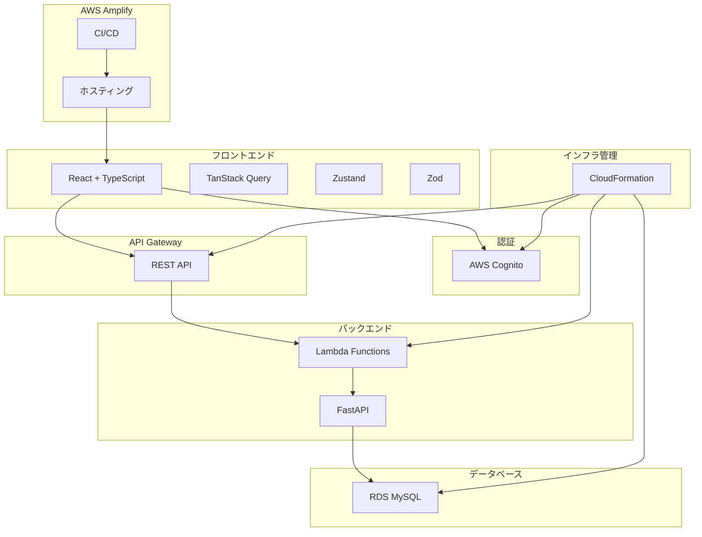
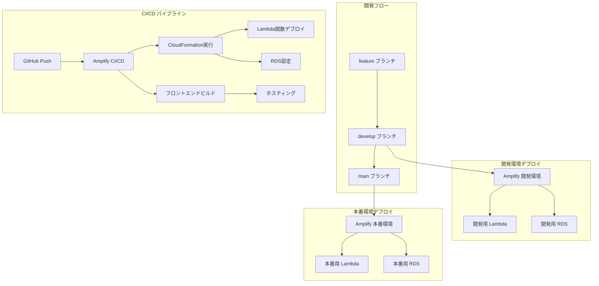

# 設計書

## 概要

プログラミング学習アプリは、AWS 上でサーバーレスアーキテクチャを採用したフルスタック Web アプリケーションです。フロントエンドは React + TypeScript で構築し、バックエンドは FastAPI + Lambda で実装します。ユーザー認証には Cognito、データベースには RDS（MySQL）を使用し、全体のインフラは CloudFormation で管理します。CI/CD は AWS Amplify の統合機能を活用します。

## アーキテクチャ

### システム全体構成



### 技術スタック詳細

#### フロントエンド構成

- **React + TypeScript**: モダンな UI 開発
- **TanStack Query**: サーバー状態管理、キャッシュ、同期
- **Zustand**: 軽量なクライアント状態管理
- **Zod**: 型安全なスキーマ検証
- **AWS Amplify**: ホスティング、CI/CD、デプロイメント

#### バックエンド構成

- **FastAPI**: 高性能な Python Web フレームワーク
- **生 SQL**: ORM を使わない直接的なデータベース操作
- **AWS Lambda**: サーバーレス実行環境
- **AWS RDS (MySQL)**: マネージドデータベース

#### インフラ構成

- **AWS Cognito**: ユーザー認証・認可
- **CloudFormation**: Infrastructure as Code
- **AWS Amplify**: 統合 CI/CD パイプライン

### 環境構成とブランチ戦略

#### Git Flow ブランチ戦略

```mermaid
gitgraph
    commit id: "初期コミット"
    branch develop
    checkout develop
    commit id: "開発基盤"
    branch feature/auth
    checkout feature/auth
    commit id: "認証機能"
    checkout develop
    merge feature/auth
    branch feature/exercise
    checkout feature/exercise
    commit id: "演習機能"
    checkout develop
    merge feature/exercise
    checkout main
    merge develop id: "v1.0リリース"
```

#### 環境とブランチの対応

1. **ローカル環境**

   - ブランチ: 任意（feature/\*, develop）
   - フロントエンド: localhost:3000
   - バックエンド: localhost:8000
   - データベース: ローカル MySQL

2. **開発環境**

   - ブランチ: develop
   - フロントエンド: Amplify 開発環境（dev-curriculum.amplifyapp.com）
   - バックエンド: Lambda + API Gateway（開発用）
   - データベース: RDS 開発インスタンス

3. **本番環境**
   - ブランチ: main
   - フロントエンド: Amplify 本番環境 + 独自ドメイン
   - バックエンド: Lambda + API Gateway（本番用）
   - データベース: RDS 本番インスタンス（独立）

### デプロイメントフロー



#### ブランチ別デプロイメント戦略

- **feature ブランチ**: ローカル開発のみ
- **develop ブランチ**: 開発環境への自動デプロイ
- **main ブランチ**: 本番環境への自動デプロイ

## コンポーネントとインターフェース

### フロントエンドコンポーネント構成

```
src/
├── components/           # 再利用可能なUIコンポーネント
│   ├── auth/            # 認証関連コンポーネント
│   ├── exercise/        # 演習関連コンポーネント
│   ├── progress/        # 進捗関連コンポーネント
│   └── common/          # 共通コンポーネント
├── pages/               # ページコンポーネント
│   ├── Dashboard.tsx    # ダッシュボード
│   ├── Exercise.tsx     # 演習ページ
│   ├── Profile.tsx      # プロフィールページ
│   └── Auth.tsx         # 認証ページ
├── hooks/               # カスタムフック
│   ├── useAuth.ts       # 認証フック
│   ├── useExercise.ts   # 演習フック
│   └── useProgress.ts   # 進捗フック
├── store/               # Zustand状態管理
│   ├── authStore.ts     # 認証状態
│   └── uiStore.ts       # UI状態
├── api/                 # API呼び出し
│   ├── auth.ts          # 認証API
│   ├── exercise.ts      # 演習API
│   └── progress.ts      # 進捗API
├── schemas/             # Zodスキーマ
│   ├── auth.ts          # 認証スキーマ
│   ├── exercise.ts      # 演習スキーマ
│   └── progress.ts      # 進捗スキーマ
└── utils/               # ユーティリティ
    ├── constants.ts     # 定数
    └── helpers.ts       # ヘルパー関数
```

### バックエンド API 構成

```
backend/
├── src/
│   ├── handlers/        # Lambda関数ハンドラー
│   │   ├── auth/        # 認証関連API
│   │   ├── exercise/    # 演習関連API
│   │   └── progress/    # 進捗関連API
│   ├── models/          # データモデル
│   │   ├── user.py      # ユーザーモデル
│   │   ├── exercise.py  # 演習モデル
│   │   └── progress.py  # 進捗モデル
│   ├── database/        # データベース操作
│   │   ├── connection.py # DB接続管理
│   │   └── queries.py   # SQL クエリ
│   ├── services/        # ビジネスロジック
│   │   ├── auth_service.py      # 認証サービス
│   │   ├── exercise_service.py  # 演習サービス
│   │   └── progress_service.py  # 進捗サービス
│   └── utils/           # ユーティリティ
│       ├── validators.py # バリデーション
│       └── exceptions.py # 例外処理
├── infrastructure/      # CloudFormationテンプレート
│   ├── main.yaml        # メインスタック
│   ├── database.yaml    # データベーススタック
│   └── api.yaml         # APIスタック
└── requirements.txt     # Python依存関係
```

## データモデル

### ユーザーテーブル (users)

```sql
CREATE TABLE users (
    id VARCHAR(36) PRIMARY KEY,           -- Cognito User ID
    email VARCHAR(255) UNIQUE NOT NULL,   -- メールアドレス
    username VARCHAR(50) UNIQUE NOT NULL, -- ユーザー名
    created_at TIMESTAMP DEFAULT CURRENT_TIMESTAMP, -- 作成日時
    updated_at TIMESTAMP DEFAULT CURRENT_TIMESTAMP ON UPDATE CURRENT_TIMESTAMP -- 更新日時
);
```

### 演習テーブル (exercises)

```sql
CREATE TABLE exercises (
    id INT AUTO_INCREMENT PRIMARY KEY,    -- 演習ID
    title VARCHAR(255) NOT NULL,          -- 演習タイトル
    description TEXT NOT NULL,            -- 演習説明
    difficulty ENUM('beginner', 'intermediate', 'advanced') NOT NULL, -- 難易度
    language VARCHAR(50) NOT NULL,        -- プログラミング言語
    initial_code TEXT,                    -- 初期コード
    solution_code TEXT,                   -- 解答コード
    test_cases JSON,                      -- テストケース
    created_at TIMESTAMP DEFAULT CURRENT_TIMESTAMP, -- 作成日時
    updated_at TIMESTAMP DEFAULT CURRENT_TIMESTAMP ON UPDATE CURRENT_TIMESTAMP -- 更新日時
);
```

### 進捗テーブル (progress)

```sql
CREATE TABLE progress (
    id INT AUTO_INCREMENT PRIMARY KEY,    -- 進捗ID
    user_id VARCHAR(36) NOT NULL,         -- ユーザーID
    exercise_id INT NOT NULL,             -- 演習ID
    status ENUM('not_started', 'in_progress', 'completed') DEFAULT 'not_started', -- ステータス
    submitted_code TEXT,                  -- 提出コード
    score INT DEFAULT 0,                  -- スコア
    attempts INT DEFAULT 0,               -- 試行回数
    completed_at TIMESTAMP NULL,          -- 完了日時
    created_at TIMESTAMP DEFAULT CURRENT_TIMESTAMP, -- 作成日時
    updated_at TIMESTAMP DEFAULT CURRENT_TIMESTAMP ON UPDATE CURRENT_TIMESTAMP, -- 更新日時
    FOREIGN KEY (user_id) REFERENCES users(id) ON DELETE CASCADE,
    FOREIGN KEY (exercise_id) REFERENCES exercises(id) ON DELETE CASCADE,
    UNIQUE KEY unique_user_exercise (user_id, exercise_id)
);
```

## エラーハンドリング

### フロントエンドエラーハンドリング

1. **API エラー**: TanStack Query のエラーハンドリング機能を使用
2. **バリデーションエラー**: Zod スキーマによる型安全な検証
3. **認証エラー**: Cognito エラーの適切な処理とリダイレクト
4. **ネットワークエラー**: 再試行機能とオフライン対応

### バックエンドエラーハンドリング

1. **HTTP エラー**: FastAPI の例外ハンドラーによる統一的な処理
2. **データベースエラー**: 接続エラーとクエリエラーの適切な処理
3. **認証エラー**: Cognito トークン検証エラーの処理
4. **バリデーションエラー**: Pydantic モデルによる入力検証

### エラーレスポンス形式

```json
{
  "error": {
    "code": "VALIDATION_ERROR",
    "message": "入力データが無効です",
    "details": {
      "field": "email",
      "reason": "有効なメールアドレスを入力してください"
    }
  }
}
```

## テスト戦略

### フロントエンドテスト

1. **単体テスト**: Jest + React Testing Library

   - コンポーネントの動作テスト
   - カスタムフックのテスト
   - ユーティリティ関数のテスト

2. **統合テスト**: Cypress
   - ユーザーフローのテスト
   - API 統合のテスト

### バックエンドテスト

1. **単体テスト**: pytest

   - サービス層のテスト
   - データベース操作のテスト
   - バリデーション機能のテスト

2. **API テスト**: FastAPI TestClient
   - エンドポイントのテスト
   - 認証機能のテスト

### インフラテスト

1. **CloudFormation テンプレート検証**
2. **デプロイメントテスト**
3. **セキュリティ設定の検証**

## セキュリティ考慮事項

### 認証・認可

- AWS Cognito による安全な認証
- JWT トークンの適切な管理
- セッション管理とタイムアウト

### データ保護

- HTTPS 通信の強制
- 機密データの暗号化
- SQL インジェクション対策

### アクセス制御

- IAM ロールによる最小権限の原則
- CORS 設定の適切な管理
- API レート制限

## パフォーマンス最適化

### フロントエンド

- コード分割とレイジーローディング
- TanStack Query による効率的なキャッシュ
- 画像最適化と CDN 活用

### バックエンド

- データベース接続プールの活用
- SQL クエリの最適化
- Lambda 関数のコールドスタート対策

### インフラ

- CloudFront による CDN 配信
- RDS の適切なインスタンスサイズ選択
- Auto Scaling の設定
